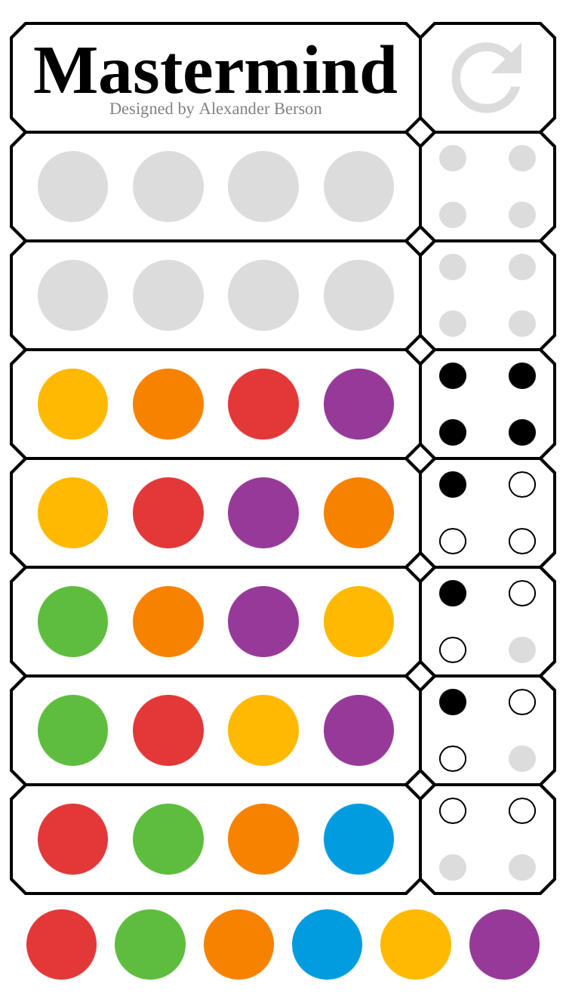

# Mastermind

Following the hints, solve the secret code consisting of four different colors. 
You can play [Mastermind online](https://alex-berson.github.io/mastermind/) or  

## Description

**Mastermind** or **Master Mind** is a classic game of logic and deduction. 

The object of the game is to solve the secret code consisting of four different colors. 

_A black dot_ means that one of the colors is guessed and located in the correct position.  

_A white dot_ means that one of the colors is guessed but located in the wrong position. 

## Screenshot

  

## License

Copyright &copy; 2021 Alexander Berson. This project is licensed under the [MIT license](LICENSE.txt "MIT License").

